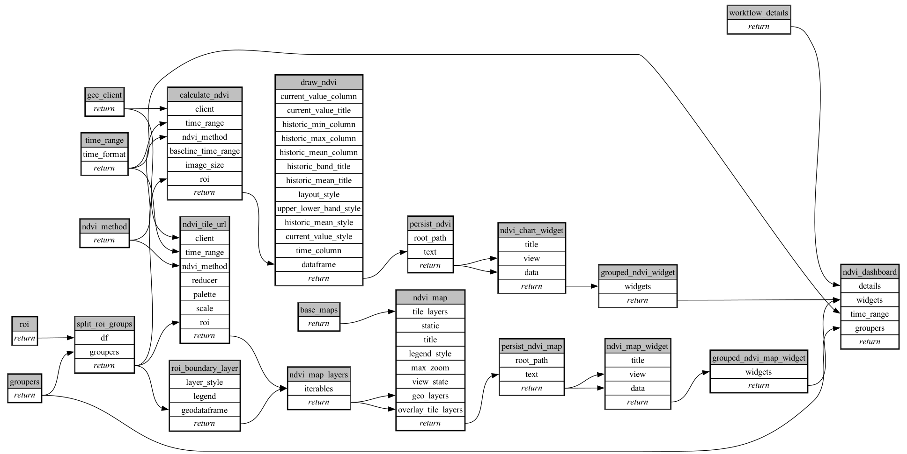

```
# AUTOGENERATED BY ECOSCOPE-WORKFLOWS; see fingerprint in README.md for details

```

```yaml
# fingerprint:
artifacts_sha256_basic: f823cfebf3d091011085b3e888588211515104b7752ca24ff98fd52fa571e142
artifacts_sha256_strict: 894618a23f15cf291df59c11c878dd4a3b990f7993c13d742b2830381b83d700
installed_requirements:
- channel: file:///tmp/ecoscope-workflows/release/artifacts/
  name: ecoscope-workflows-core
  version: {version: ==0.22.14}
- channel: file:///tmp/ecoscope-workflows/release/artifacts/
  name: ecoscope-workflows-ext-ecoscope
  version: {version: ==0.22.14}
- channel: file:///tmp/ecoscope-workflows-custom/release/artifacts/
  name: ecoscope-workflows-ext-custom
  version: {version: ==0.0.34.dev47+g21b717ec2}
- channel: https://repo.prefix.dev/ecoscope-workflows-custom/
  name: pydeck
  version: {version: ==0.9.1a2}
params_sha256: 1dfd3dfadd36afbde1e2a7828062fba14362c80b355c810df1779f0607456a4e
spec_sha256: 09bc9fe5e336aa72857fbd16ae85b7da73049afb0e8923d2cd7186dd2100fb1f

```

# ecoscope-workflows-ndvi-workflow


